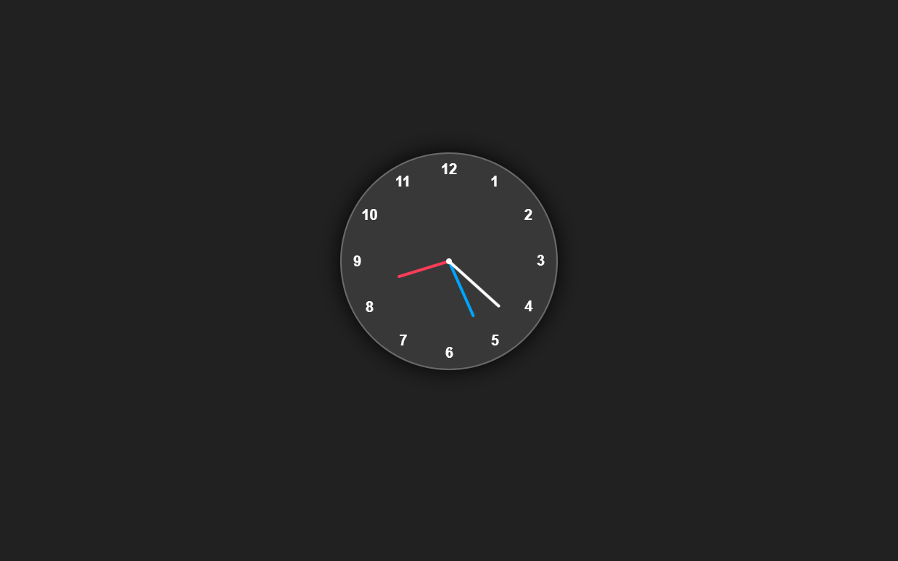

# Simple Analog Clock

A **Simple Analog Clock** built using **HTML**, **CSS**, and **JavaScript**. This project showcases a functional and visually appealing analog clock that dynamically updates to reflect the current time.

---

## Features

- **Real-Time Clock**: Displays the current time accurately using JavaScript.
- **Smooth Animations**: Clock hands move smoothly for a realistic effect.
- **Responsive Design**: The clock adapts to various screen sizes.
- **Simple and Clean UI**: Minimalistic design for better aesthetics.

---

## Technologies Used

- **HTML**: Provides the structure of the clock.
- **CSS**: Adds styling and animations for the clock's appearance.
- **JavaScript**: Handles the logic for updating the clock hands in real-time.

---

## Screenshots

